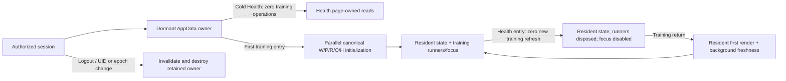

# Phase 2A — authenticated-session training retention

Implementation baseline: fetched `main` / `origin/main`
`fcf73cca1ab3e8c776400256dc03e7f3497ba19b`, 2026-10-05.
Working repository: `/Users/johnfolstrom/Desktop/training-web`.
Remote: `https://github.com/cgradbad89/training-web.git`.
There were no tracked/staged changes and nine pre-existing untracked owner files;
all are excluded from the implementation and preserved.

W = raw workouts, P = plans, R = races, O = workout overrides,
H = settings/HR anchors. Health metrics are a separate page-owned source.

## Architecture and ownership

`AuthProvider` remains the single authorized Firebase observer. It now exposes
an authenticated-session epoch and a synchronous validity guard. Repeated
observations of the same authorized UID retain the epoch. Logout, unauthorized
identity, UID change and auth-provider disposal invalidate it before publishing
React state. Logout/login to the same UID advances it even when React batches
both observations without rendering signed-out content between them.

`AuthGuard` hands the resolved user/epoch/guard to the authenticated layout.
`AppDataProvider` internally keys its existing canonical state owner by UID and
epoch. The owner stays mounted across Health; **mounting does not activate it**.
`trainingActive` is false for `/health` and its descendants. First training
activation starts the existing W/P/R/O/H loaders in parallel; Health-only
sessions never start those reads. `trainingActivated` distinguishes a dormant
owner from an activated one. Ordinary training navigation retains the owner and
starts no new canonical reads.

The layout mounts `AutoMatchRunner` and `PRComputerRunner` only on training
surfaces. Their unmount disposes the listener/idle work and invalidates pending
runner generations. Retained data does not keep either runner alive on Health.
Training visibility handling is disabled on Health; the default Health focus
hook and all Health page reads/cache behavior remain unchanged.

Canonical source results, mutations and queued reads require both the existing
provider request generation and the authenticated-session validity guard.
Identity replacement creates fresh arrays, statuses, pending-request refs and
reconciliation metadata. Genuine unmount retires the owner. Strict Mode cleanup
retires one effect generation and replay restores ownership before activating
fresh reads; the existing Phase 1 regression remains intact.

Before: `Training[initialize + runners] → Health[destroy + stop] → Training[cold initialize + runners]`.
After: `Training[lazy initialize + runners] → Health[retain + stop] → Training[resident + freshness + runners]`.

## Freshness contract

- **Same local day:** use the existing overlap-delta request from the newest
  resident workout date minus seven days (empty history uses now minus seven
  days). Return and visibility share a 30-second automatic-request floor, begun
  at initial/full/delta request start. If a same-day read is still pending,
  callers reuse it. A return within the floor starts no additional W request;
  P/R/O/H still revalidate.
- **Later local day:** request full authoritative newest-1000 reconciliation.
  Only a successful full advances the local-day marker and full-reconciliation
  version. A full behind a delta is promoted once when the delta finishes;
  visibility/manual callers reuse the active/queued work. There is no additional
  delta for that transition. Subsequent eligible same-day visibility uses delta.
- **P/R/O/H:** each return starts one background revalidation or joins that
  source's existing pending read. Resident arrays/maps/settings are never
  cleared. A successful empty result or missing settings is resident success,
  just like nonempty data. Failed reads keep useful resident values, report the
  existing `error` resolution/log and remain retryable.
- **Manual refresh:** W always means full reconciliation, including queued full
  behind delta. P/R/O/H use the existing canonical loaders, with pending request
  reuse. Post-write plan/settings callers explicitly use `afterMutation` so an
  older pending read cannot falsely satisfy freshness after a persisted write.
- **Successful mutations while refreshing:** source mutation versions suppress
  pre-write P/R/O/H publication. A persisted plan/race/override patch issues no
  read ordinarily; if an older source read is pending, it queues one fresh read
  behind it. Successfully persisted training-load fields are overlaid on a W
  snapshot requested before the patch, without another W query. This metadata
  exists only for that pending request and is discarded on retirement.
- **Visibility:** the generic hook still defaults to its prior 30-second policy
  for Health. AppData enables it only for training. Return/visibility use one W
  coordinator and floor, so an event during or immediately after return adds no
  duplicate W request. Entering Health itself initiates no source revalidation.
- **Rapid transitions:** pending canonical reads may settle into the same
  authenticated owner's resident state while paused. Returns join those reads;
  source mutation queues and W full promotion retain generation/session guards.
  A new authenticated session cannot join or receive any of the old work.

AutoMatch retains its active/due-plan eligibility, server-filtered 250 first
page, cursor paging, candidate content key, fresh plan retrieval before writes,
latest overrides, changed-snapshot queue and successful-full recovery version.
It waits for the explicit return plan revalidation before reopening its listener.
Retired matching work cannot initiate another plan write or refresh shared plans;
a write already submitted before cancellation cannot be revoked. The resumed
listener still observes delayed ingest. A later full reconciliation can restart
a currently eligible listener again through its existing recovery policy; no
more than one subscription is live.

PR keeps `pr_last_computed` in localStorage with the unchanged 24-hour duration,
idle scheduling, bounded-history reuse and unbounded fallback only when capped.
It cannot schedule against a dormant owner. Cleanup of an incomplete attempt
resets the scheduling guard, fixing the pre-existing cancelled-idle/Strict Mode
suppression defect. Late cancelled reads/commits cannot update the throttle.
A completed recent attempt prevents another scheduling/computation on return.

## Loading and errors

The existing three resolution values remain unchanged; new resident refresh
flags prevent cold skeletons after a successful source load. Successful
settlement gates for enrichment, Coach, prediction hydration and aggregate
persistence still require `resolution === "success"`; refresh errors are not
hidden as success.

| State | Activated | Loading | Refreshing | Resolution / resident data |
| --- | --- | --- | --- | --- |
| Cold Health / never activated | false | false | false | no training read; provisional `loading` resolution is not success |
| First training render / initial read | true after activation effect | true | false | loading, no authoritative data |
| Loaded (including empty/null) | true | false | false | success, resident |
| Background revalidation | true | false | true | loading, resident retained |
| Refresh failed with resident data | true | false | false | error, resident retained |
| Initial load failed | true | false | false | error, no successful residency; retry is cold loading |

The first training render from a dormant Health owner still exposes cold-loading
flags; a warm return exposes resident data and cold-loading flags remain false.
The first return render deliberately marks plans unresolved for AutoMatch
eligibility until the explicit plan return read settles, without discarding plans
or triggering a cold skeleton. The activation commit also settles this barrier
when loaders return identical resident object references.

## Automated lifecycle evidence

`src/app/(app)/__tests__/trainingSessionLifecycle.test.tsx` contains **33 tests**
using the real AuthProvider, AuthGuard, authenticated layout, AppDataProvider,
AutoMatchRunner, PRComputerRunner and Health page, with mocked external reads,
matching persistence and PR computation. It exercises:

1. Cold Health and descendant Health: exact W/P/R/O/H = **0/0/0/0/0**, AutoMatch
   subscriptions = **0**, PR scheduling/computation = **0**, training delta/full
   focus reconciliation = **0**. Health metrics/goals reads occur normally;
   a Health visibility event refreshes Health metrics and leaves training at zero.
2. First training activation: five canonical loaders once, existing parallel
   pending semantics, canonical page state and eligible runner activation.
3. Training-to-training: identical resident references, no new canonical reads
   or runner restart.
4. Training-to-Health: identical W/P/R/O/H references, no source read, listener
   stop, cancelled idle work, no training visibility reconciliation even next day.
5. Same-day warm return: resident first committed render; W full remains one,
   one eligible overlap delta; each P/R/O/H call count advances from one to two;
   all cold-loading flags remain false while five refresh flags are true.
   Visibility both during and immediately after completion adds no W request.
6. Return within 30 seconds: zero additional W request; P/R/O/H each revalidate.
7. Later-day return: resident first, full count advances one to two, delta zero;
   day/version advance only on success, next eligible focus becomes delta.
8. Same/later-day failure of all five sources: resident values survive, each
   resolution reports error, refresh flags settle; later return succeeds and
   failed later-day full retries full rather than delta.
9. Rapid transitions with all return reads pending: one delta and one read per
   P/R/O/H, pending consumer promises reused, no orphan/multiple listeners.
10. Full-behind-delta on later-day return: exactly one queued full, reused by
    simultaneous visibility/manual callers.
11. Initial pending and failed loads across Health; successful empty/null
    residency; identical object reference return; retained 1000-row delta
    merge/dedupe/truncation; manual full semantics.
12. Persisted mutation races: targeted P/R/O publication survives older return
    results; queued post-write P/H freshness; no queued read crosses identity;
    full/delta W both preserve later persisted enrichment fields.
13. Batched A→logout→B and A→logout→A: zero A publication into the new owner;
    pending initial/return sources and old mutation callbacks rejected.
14. Genuine unmount and same-UID remount; cold Health Strict Mode; cold training
    replay rejecting first-generation responses and leaving one active listener.
15. Late AutoMatch candidate/fresh-plan/persistence work and late PR all-time
    reads: no retired matching/publication/throttle update across pause/identity.

Additional focused tests: Auth session epochs/synchronous retirement (**2 new**),
PR dormant/Strict Mode/cancelled-snapshot/pending-read/24-hour behavior (**6 new**),
and AutoMatch persistence cancellation (**2 new**). The layout scope test now
asserts a dormant owner on Health and absent runners. Existing Coach, Routes,
Workouts, Plan Insights, GPS, AutoMatch candidate/reconciliation and Health page
regressions remain part of validation. **43 repository tests added** total.

## Measured application-operation comparison

The actual Phase 1 source SHA above was exported to a temporary checkout and
run with the same mocked service fixtures and real layout/provider/runners/Health
page. Two baseline tests passed: cold Health isolation and the full round trip.
The current integration assertions cover the corresponding after measurements.
No production navigation/data mutation is used.

For an eligible same-day return after 60 seconds with one due active workout
plan, no incoming listener snapshot and a completed initial PR attempt:

| Operation | Phase 1 | Phase 2A |
| --- | --- | --- |
| Initial W full top-1000 / P / R / O / H | 1 / 1 / 1 / 1 / 1 | 1 / 1 / 1 / 1 / 1 |
| Enter Health: additional training reads | 0 | 0 |
| Canonical W/P/R/O/H during Health | owner destroyed | same references retained |
| Return cold initialization invocations | 1 / 1 / 1 / 1 / 1 | 0 / 0 / 0 / 0 / 0 |
| Return background W full / delta | 1 / 0 (cold load) | 0 / 1 (reconciliation) |
| Return P/R/O/H background revalidation | remount reads above | 1 / 1 / 1 / 1 |
| Total W full / delta across sequence | 2 / 0 | 1 / 1 |
| Total P/R/O/H each | 2 | 2 |
| AutoMatch listener starts / Health stop / live after return | 2 / 1 / 1 | 2 / 1 / 1 |
| PR idle scheduling / computation attempts | 1 / 1 | 1 / 1 |
| PR scheduling/computation on Health | 0 / 0 | 0 / 0 |
| Return cold-loading flags | all five true, arrays empty | all five false, resident first |
| Return resolutions | loading → success/error on cold owner | loading → success/error with resident values |
| Return refresh flags while pending | fresh owner's cold loading | all five true, usable values retained |

The eliminated return operations are the **five cold initialization paths** and
**one full W1000 query**, replaced by one eligible overlap delta and four explicit
background source revalidations. Total canonical service/query invocations for
this eligible same-day sequence remain **10 before / 10 after**. It would be
incorrect to claim five fewer queries. A return within 30 seconds uses **9 after**
(no extra W request); later-day full reconciliation retains **10 after** and the
same two full W reads for correctness. Warm presentation and workout query shape
improve; dataset freshness is retained. These are application-operation counts,
**not independently measured billed Firestore savings**.

## Validation and scope

Final local validation: focused affected suites **210 passed / 17 files**;
33 lifecycle integration tests passed; 43 new repository tests; **1689 passed, 12 skipped / 1701 total**
across 154 files (147 passed, 7 skipped). `npm run typecheck` passed.
`npm run lint:ci` passed with zero errors / the existing 103 warnings within the
104 ceiling; the new lifecycle file also passed explicit ESLint.
`TZ=America/New_York npm run build -- --webpack` passed, followed by
`TZ=America/New_York npm test`. Protected-main PR, GitHub and Vercel check
results and the final merge SHA are reported in the delivery summary.
Local production builds use `npm run build -- --webpack`, as in Phase 1's
host-compatible validation; no build script or CI/Vercel bundler configuration
changes. GitHub/Vercel validate their normal production build paths.

Preserved: all nine unrelated owner files; owner-managed Firestore rules;
existing dependencies; raw W, effective selectors, Coach Health30 and AI submit
separation, Routes raw-first-500, Workouts successful-settings/raw enrichment,
Plan Insights consumer/settlement/stale guards, GPS UID/session/dedup safety.
No production data writes, Firestore rules/index deployment, schema changes,
Health rolling/YTD/All cache retention/redesign, shoe/start-coordinate cache,
AutoMatch query/pagination change, PR computation/persistence redesign, custom
raw-data persistence, state/query dependency or broad page redesign.

Limits: tests measure application operations using mocks, not production latency
or billing. Submitted remote writes cannot be revoked; retirement suppresses
further writes/publication/throttle updates. Shared workout history stays bounded
to 1000 and same-day overlap remains intentionally incomplete for older imports;
daily/manual full and AutoMatch reconciliation recovery remain the contract.

Phase 2A evidence supports proceeding to a **separate Phase 2B**: training
retention and activity gating no longer require Health to own training data.
Actual Health visibility reads are preserved while training operations stay zero.
Health still has component-lifetime cache state, so bounded-range correctness,
retention, deletion and rollover need their own measurements and tests. None of
Phase 2B is implemented here.
