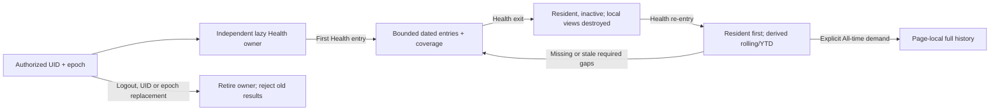

# Phase 2B — bounded Health correctness and session retention

## Revalidated baseline and source inspection

On 2026-10-05, `/Users/johnfolstrom/Desktop/training-web` was on `main` at
`bdd0d1a1dd7904b1fc334cd43d0c82b5d1ee1f8e`. A fresh `git fetch origin main`
confirmed the same `origin/main` and `FETCH_HEAD`. Remote:
`https://github.com/cgradbad89/training-web.git`. No tracked or staged changes;
nine untracked owner files were inventoried and SHA-256 recorded outside the
repository. Implementation branch: `feat/health-bounded-session-cache`.
Baseline Health/cache/Phase 2A lifecycle suites: **58 passed / 3 files**.

Inspection before implementation covered CLAUDE.md, current PRD architecture,
Health data model/calculations/sharp edges/backlog, Phase 1/2A documents, Health
page/charts/rings/Calendar/goals, services/cache/focus helpers, AuthContext,
AuthGuard, authenticated layout, AppData ownership, associated tests and
existing Health performance marks.

| Source/state | Baseline query, date semantics, lifecycle |
| --- | --- |
| Daily metrics | `users/{uid}/healthMetrics`; one daily document with local `YYYY-MM-DD`, containing body/activity/sleep/brushing/VO2 fields; no different per-field date key |
| Rolling | `fetchHealthMetrics(uid, 90)`: local today minus 90 days, inclusive lower bound, descending, no upper predicate; mutable page array plus cache entries |
| Coverage | Sorted inclusive merged intervals; successful empty results cover dates; no age/error metadata; union merges cannot remove omitted documents |
| YTD | Demand from Today rings or visible Trends; Jan 1 through local today gaps; separate mutable YTD snapshot and mount-terminal success flag; rolling changes cannot update it |
| Calendar | Current Mon–Sun, navigable whole months, current-year-to-date; uncovered inclusive gaps; arbitrary older months can grow page cache |
| All-time | Visible Trends only; unchanged ascending unbounded query; page array also seeds all-date coverage/cache, making the old cache unsuitable for bounded session retention |
| Threshold goals | One settings/healthGoals document, page fetch and explicit modal writes |
| Ring goals | Effective-dated append-only healthGoals versions, page fetch; shared ring helpers resolve goals per local date |
| Hourly HR | Separate singleton document with hour buckets/periodDays; page fetch, not dated daily history |
| Refresh | Mount, explicit Refresh, visible-tab event after 30 seconds; rolling promise reuse, independent Calendar/YTD request guards |
| Errors/loading | Initial rolling skeleton/error; resident rolling content preserved on refresh failure with console error; lazy range errors log and retry on reselection |
| Rollover defects | Rolling marks through 9999-12-31 covered; selected today and terminal YTD flags can stay on prior day/year; no explicit day activation policy |
| Auth | Phase 2A UID + authenticated epoch, synchronous validity guard; lazy training owner retained across Health, runners/focus training-gated; Health async fetches lack equivalent guards |
| Persistence | KPI selection and Trends range preferences only; SDK Firestore persistence unchanged; no app raw Health persistence |
| Derivations | Chart slices, current/prior fallback values, daily/period rings, averages, circular sleep-time means, summaries derived in mounted page; formulas must remain unchanged |

The old audit's deletion/YTD duplication findings are confirmed. Additional
source constraints: future coverage is unsafe across day rollover, All-time
must stop seeding the retained cache, and the 30-day Today navigator can request
the previous year's YTD in January. Those require a bounded retention policy
that includes the earliest reachable navigator year's January 1.

## Final architecture and lifetime

`src/contexts/HealthDataContext.tsx` owns a `HealthMetricsStore` under the same
resolved authorized UID/session epoch as Phase 2A. The training `AppDataProvider`
is unchanged. The Health store shell has `cache: null`; a training-only session
creates no metric cache, calls no Health service and mounts no Health consumer.
Only Health subscribes to its external snapshot. Resident storage does not
render charts or recompute training pages.

Before: `Health[rolling array + cache + YTD snapshot] → exit[destroy] → Health[read again]`.
After: `Health[canonical bounded source] → Training[retain, no Health activity] → Health[resident projections + exact required gaps]`.

### Bound and date semantics

The rolling product cutoff remains **today minus 90 local calendar days,
inclusive** (91 possible daily dates), with today's date now an explicit upper
bound. Retention starts at the earlier of that cutoff and January 1 of the
earliest year reachable by the existing **30-day** Today navigator. Most of the
year this includes current YTD. During January it can include the previous
anchor year's YTD, needed when navigating December 31 and selecting YTD. The
window has at most **396 daily coverage keys**, and only requested dates are
populated; establishing the window does not prefetch it.

Rows/coverage outside the current retention interval are pruned on active
requests/results. No future date is successfully covered until actually queried
on/after that local day. Calendar months outside these bounds retain their
existing inclusive queries but have a separate **page-local** cache containing
only outside dates. A month crossing a retention boundary splits into its exact
bounded and page-local portions; no enormous superset query is issued.

Daily metric fields retain their common document date. Hourly HR is a separate
singleton with different time semantics; it is not normalized into daily rows.
Threshold/ring goals remain their existing page-owned sources. Coach Health30,
Dashboard health windows and Personal Insights VO2 freshness remain independent
and unchanged; this phase implements Health's own lifecycle only.

### Canonical and coverage contract

- One `Map<string, HealthMetricsCacheEntry>` holds bounded daily documents.
  Rolling is its descending 90-day projection (preserving newest-prior fallback
  order); YTD is its ascending current-year projection; anchor-year ring data
  projects the precise local anchor range. No mutable rolling/YTD snapshots.
- Sorted, disjoint, inclusive `coveredRanges` record successful query knowledge,
  including empty results. Per-date `coverage` records `lastSuccessAt` and
  `error`; successful coverage plus absent row means **known empty**.
- `healthDateStatus` distinguishes `never-requested`, `covered`, `covered-empty`,
  `stale`, `error`. `pendingRanges` distinguishes work in progress and cannot
  establish success. Failure preserves old success timestamps/ranges and rows;
  a failed extension has a null success timestamp and remains uncovered.
- `mergeCoveredRange` is authoritative replacement: remove all prior entries
  inside the fetched interval, insert only returned in-range entries keyed by
  date, leave outside entries intact, record coverage even for `[]`.
- All bounded dates use a **30-second last-success freshness interval**, based on
  Health's existing automatic-refresh floor. Automatic activation/visibility and
  selected-view demand query missing/stale/failed dates only. Empty dates follow
  the identical interval. No permanent empty negative cache or silently hidden
  refresh error. Selecting YTD after old dates expire revalidates those dates.
- Identical requests reuse the pending promise. Overlapping requests join their
  intersection and read only disjoint uncovered/stale portions. A failed portion
  remains retryable; successful neighboring portions keep their own freshness.
- Explicit Refresh forces the current rolling range's authoritative membership;
  existing pending intersections are reused, as before. Other current-view
  ranges use ordinary missing/stale policy. Refresh never clears resident data
  first or appends deleted rows back into canonical storage.
- `hasLoadedRolling` is successful rolling settlement, including a successful
  empty read. An early YTD response cannot mark a pending cold rolling read
  loaded. Cold errors retain the existing full-page message; resident failures
  retain the page and are represented in coverage/error state and console logs.

### Activity, rollover and identity

The authenticated layout gates Health independently from training. On an
inactive Health route, the lightweight route wrapper unmounts Health content,
even if the router keeps its outer route element. This removes its focus
handler, one local-midnight timer, page-local sources and chart computations.
The owner has no polling or Firestore listener. Pending reads submitted while
active may settle into the same session cache during inactivity. They cannot
start new work merely because data is resident.

Mounted Health activation/visibility/midnight uses one range coordinator. A new
local date updates rolling ranges and follows the Today anchor; intentionally
selected past anchors stay selected, subject to the existing 30-day limit.
Historical coverage is retained and revalidated only under ordinary freshness.
A two-second midnight transition reads just the new single day when prior dates
are still fresh. January 1 changes current YTD to that new year's January 1;
prior-year dated rows can still serve rolling/prior-anchor views without leaking
into the new YTD. No session reset is needed for a day/year change.

Both request generation and AuthContext's synchronous session validity guard
must match before publication, failure metadata or pending-request removal.
Logout/UID replacement/same-UID new epoch and disposal retire the store. Strict
Mode replay establishes a new generation; old work cannot remove its requests
or modify its entries/freshness/errors. Page-local All-time/Calendar/goals/hourly
responses also require a live page mount generation and session epoch.

### All-time and calculations

`fetchAllHealthMetrics(uid)` is unchanged (unbounded ascending date query), runs
only for a visible Trends All consumer, stays local to the active Health page
and is discarded on exit. It never seeds bounded entries or coverage, even for
dates also inside rolling/YTD. Lazy All errors still retry on reselection; no
new All-time freshness/persistence policy was introduced. Returning and choosing
All again performs its normal query. Loading All no longer preloads arbitrary
Calendar history into retained storage; older months remain demand-only.

All formulas, goals, units, date-filter logic, chart props/content, HR/threshold
logic, VO2 computations, ring/summary math and sleep circular means are unchanged.
Differences in displayed totals arise from canonical updates/deletions and
correct local date/year activation. The existing data-ready mark identifies a
resident entry as `local-cache`; it logs only structural source/timing metadata.
No raw samples, metric values, UID or identifiable Health payloads are logged by
new instrumentation.

## Correctness and operation evidence

Five tests ran against the **actual baseline SHA** exported into a temporary
checkout with the original layout/Auth/AppData/runners/Health page and mocked
services. All passed: fresh/stale and next-day round trips, the mounted midnight
visibility floor, and a stale YTD deletion reproduction. Baseline helpers/sources were not modified. New assertions use
those same integrated surfaces with the current implementation; no production
navigation or writes were used.

| Application operation | Before Phase 2B | After Phase 2B |
| --- | --- | --- |
| First Health bounded query | 1 rolling lower-bound query | 1 inclusive 90-day-through-today range query |
| Health → Training residency | destroyed page cache | same bounded entries/coverage retained |
| Inactive Health metric/All-time reads | 0 / 0 | 0 / 0, including retained route element |
| Return within 10 seconds: bounded query | 1 repeated rolling read | 0; all required dates fresh |
| Total bounded queries for that round trip | 2 | 1 |
| Return after 60 seconds: bounded query | 1 repeated rolling read | 1 exact stale rolling range; resident first |
| Visibility during/immediately after stale return | guarded pending rolling refresh | 0 additional reads; same pending/fresh ranges |
| Two-second next-day return | 1 repeated full rolling query | 1 single-day missing-range query; historical dates reused |
| Two-second midnight visibility while mounted | 0 new-day reads inside the old 30-second hook floor | 1 single-day missing-range query; Today advances |
| First YTD demand after rolling success | 1 Jan 1 → cutoff-minus-one gap + independent snapshot | same 1 gap; derive current canonical rows |
| Rolling refresh deletes Sep 15 already in YTD | independent YTD retains deleted total | zero separate YTD read while fresh; total updates from canonical |
| Full-range response Oct 1/3 omits cached Oct 2 | union cache retains Oct 2 | Oct 2 removed; outside dates unchanged |
| All-time on new active page | explicit unbounded query | same explicit query, no bounded cache expansion |

These are **mocked application/service operation counts**, not measured billed
Firestore reads, production latency or financial savings. A stale return retains
its one correctness read; this phase does not claim every re-entry saves queries.
Threshold goals, ring versions and hourly HR still run their page-entry reads.
YTD focus can require two disjoint ranges (rolling plus older YTD); coordination
adds no overlap or unrelated history.

## Regression and validation record

**62 new regressions**: 9 cache-helper, 21 store/coordinator and 32 integrated
Health/session cases. All 17 existing Health page cases and 33 Phase 2A lifecycle
cases remain. Core coverage is in `healthMetricsCache.test.ts`, `healthMetricsStore.test.ts`, updated
Health page tests and the real `trainingSessionLifecycle.test.tsx`. The integrated
suite covers cold training/Health isolation, resident first return, inactive work,
authoritative changes/deletions updating YTD, parallel initial YTD, successful
empty coverage, cold/resident/extension failure and retry, active/re-entry/timer
day rollover, year and prior-anchor YTD, logout/direct UID/same-UID epoch, late
initial/refresh success/failure, genuine unmount, rapid re-entry, Strict Mode,
All-time demand/late response, old Calendar locality, retained route gating and
clamping an expired navigator anchor before deriving the required YTD.

Local validation uses mocked services, with `TZ=America/New_York`:

- Health/cache/store/session focused: **120 passed / 4 files**.
- Phase 1/2A/Health regression set: **315 passed / 21 files**, including Auth,
  AppData, authenticated layout, Coach, Routes/raw-first-500, Workouts/enrichment,
  Plan Insights hydration, GPS cache safety, runners, AutoMatch and ring math.
- Full `npm test` after a successful production build: **1,751 passed / 12
  pre-existing skipped / 1,763 total**, across **155 files**.
- `npm run typecheck`: passed.
- `npm run lint:ci`: passed, **0 errors / 100 warnings**, below the 104-warning
  repository limit; explicit lint of new production/tests adds no warnings.
- `npm run build -- --webpack`: passed, using the same host-compatible bundler
  option documented in Phase 1/2A; the application build script and CI bundler
  remain unchanged.

Desktop cloud sync reproduced the documented numbered `.next/types/* 2.ts`
artifacts. The local ignored `.next` output was moved to an external host cache
with access to the existing `node_modules`, then build and typecheck passed.
This generated-output fix is local only; no tracked build configuration or
dependency changed. Protected-main delivery additionally requires the exact PR
head's GitHub production-build and Vercel checks before merge.

Preserved: all nine owner files, Firestore rules, dependencies, production data,
Health calculations/UI, Phase 1 canonical reuse/readiness/GPS and Phase 2A lazy
training retention/runner/reconciliation policy. No new database/query/state
library, persistence, schema, chart library/design or unrelated optimization.

## Evidence-based recommendation

Move to **measurement**, using the existing sanitized performance marks and
operation traces on representative owner navigation if more performance work is
wanted. Mock evidence establishes correctness and eliminates one bounded query
on a fresh short return, but does not establish a CPU bottleneck or production
latency target. No further Health architecture phase, CPU rewrite or loading/UI
redesign is justified by this evidence. All-time and old Calendar reads remain
intentional page-local costs; goals/hourly entry reads remain outside this scope.
